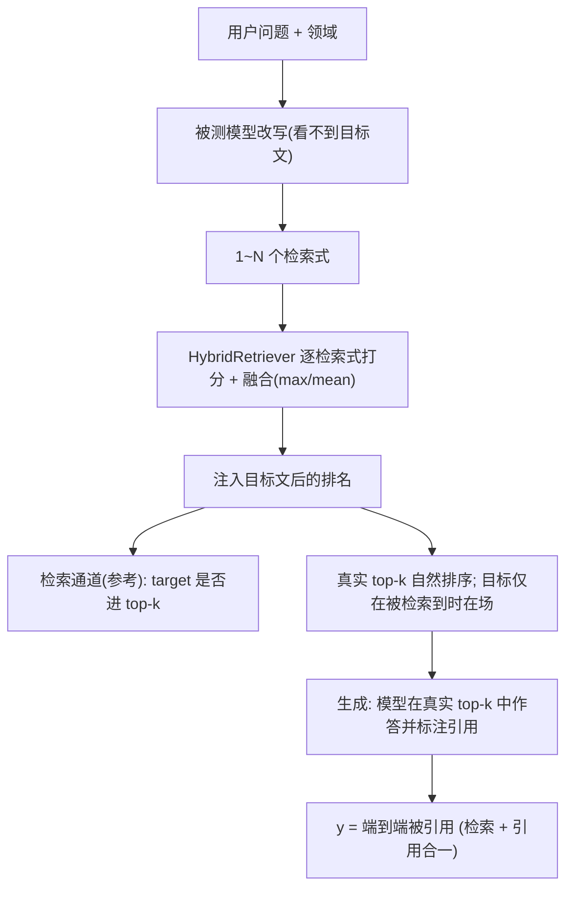

# Study 6：查询改写驱动的 RAG 检索

Study 5 用一个**固定检索器**在真实语料上召回 top-k，检索结果与被测模型无关（所有模型共享同一份 `retrieval.csv`）。Study 6 把检索的"控制权"部分交给被测模型：检索前，模型先基于用户问题改写/扩展出若干检索式，再用这些检索式驱动同一个 `HybridRetriever`。于是检索结果**因模型而异**，"结构洞"效应在检索通道上第一次可以跨模型比较。

一句话：Study 5 问"固定检索下，特征影响召回吗"；Study 6 问"当模型自己决定怎么搜、且只在真实检索结果里作答时，结构洞特征对**端到端被引用**的帮助在不同模型上是否一致"。

## 与 Study 5 的关系

- Study 5 不改动，继续作为**固定检索、双通道分解**基线（强制插入目标 + 位置轮换，分别估计 `P_retrieve` 与 `P_cite|ctx`）。
- Study 6 复用 Study 5 的目标文加载（`load_frozen_targets`）、真实语料包装（`_corpus_article`）、`output_mode="cite"` 的引用阶段与 `_scoped_ate`。
- Study 6 的关键不同：**真实端到端 RAG**——不再强制插入目标、不再位置轮换。候选集就是模型改写查询**实际检索到**的 top-k，按检索分数自然排序；目标只有真被检索到才出现（在其真实 rank 位置），否则缺席、无从引用（`y=0`）。因此 `y` 直接是"目标最终是否被引用"的端到端结果，检索与生成合为一个结局。

## 端到端管线



## 因果设计：端到端下的配对对照

- **改写不接触目标文**：`build_rewrite_messages` 只喂用户问题 + 领域提示，绝不含任何候选/目标正文。因此改写只依赖"问题"，不依赖"处理/对照"。
- **改写按 (模型, 问题) 复用**：同一模型对同一问题的改写只做一次，供该问题下全部 16 个 OFAT 目标共享。检索式对处理/对照完全一致，二者的检索差异只来自目标文本身。
- **候选集因端到端而异**：处理文与对照文各自面对自己**真实检索到**的 top-k，竞争者与目标位置都可能不同——这正是端到端要测的东西（更好的特征把目标顶到更靠前、更可能被引用）。位置不再被轮换抵消，而是作为处理效应的一部分被计入。
- **配对口径**：`ate_e2e` 按 `query_id | model | prompt_style | seed | pair_id` 配对（**不含** `target_position`，因为位置现在是检索的下游结果，纳入配对会导致处理/对照无法匹配），再按 `query_id` 聚类自助；OFAT 的 EI 仍用 `scope_col="target_dim"`。
- **语料库冻结**：只有 query 侧随模型变化，语料与向量都冻结，检索在给定缓存下可复现。

## 多检索式融合

模型可能给出多条检索式。对每条检索式，检索器都会算出一个覆盖 `[语料..., 目标]` 的融合分向量（BM25/向量与 Study 5 同口径），再逐文档合并：

- `fuse="max"`（默认）：逐文档取各检索式的最大分——"任一检索式能召回即可"，贴近多路召回取并集的直觉。
- `fuse="mean"`：逐文档取平均——更看重"多条检索式一致认为相关"。

单条检索式时，`retrieve_multi` 与 Study 5 的 `retrieve` 完全等价。

## 断点续跑与容错

生成阶段调用量大，中途被限流或被内容安全拦截时不该从头再来。

- **容错**：某次生成调用被判定为永久性拒绝（如 Kimi `content_filter` 400、`high risk`、纯 400 Bad Request）时，不再让整批崩溃，而是给该 trial 记一条哨兵行（`parse_ok=0` 且 `api_error` 非空），继续跑其余 trial。瞬时错误（限流/网络/5xx）仍走既有重试，重试耗尽才抛出。
- **被拦截 trial 按缺失数据处理**：`api_error` 非空的行在分析（`ate_e2e`/`ei`）中被剔除，不计入分母，避免把"被审核拦截"误当成"模型主动没引用"而低估效应。`ate_retrieved` 来自本地检索，不受影响。
- **续跑**：加 `--resume` 后，从各模型子目录已保存的 `rewrites.csv` 复用改写（不再重复调模型），本地重算检索，并按**语义键**跳过 `trials.csv` 里已完成的 trial，只补跑缺口。因此阶段 0 成本≈0、检索本地免费、阶段 2 只花在没跑过的调用上。
  - **语义键匹配**：已完成与否按 `query_id | model | prompt_style | seed | target_dim | role | pair_id`（都是 `trials.csv` 里已有的列）判定，而**不是** `trial_id`。因为 `trial_id` 依赖未落盘的 `ordered_ids`、无法从磁盘重算；语义键则对 `trial_id` 公式变化、旧文件、重跑都稳健，能复用你已经花钱跑出来的结果。
  - **自愈去重**：`--resume` 开跑前会先按语义键对 `trials.csv` 去重（保留首次），修复此前中断/误操作可能追加进去的重复行。
  - 不加 `--resume` 则保持默认：重跑即从头，清空旧 CSV。
  - 续跑依赖 `rewrites.csv` 在场以保证候选一致；被拦截的 trial 已记为"已完成"，续跑不会反复重试同一条。

```bash
# 第一次跑（中途被 content_filter 打断也没关系，进度已落盘）
python -m ai_structural_holes.cli study6 --models kimi/kimi-k2.5 --per-domain 50 --seeds 1 --top-k 8

# 断点续跑：只补没跑完的生成调用
python -m ai_structural_holes.cli study6 --models kimi/kimi-k2.5 --per-domain 50 --seeds 1 --top-k 8 --resume
```

## 复用 Study 1 的冻结目标文（零重复生成）

与 Study 5 相同：目标文直接加载 Study 1 已冻结的 LLM 变体，不重新调用生成模型；某目标缺少 `llm` 记录时保留模板壳子并在 `targets_manifest.csv` 标记 `template_fallback` 且告警。API 开销为**改写阶段**（每题每模型一次）与**生成阶段**。

## 调用量（取消位置轮换后）

由于不再位置轮换，每个目标只生成 **1 次**（Study 5 是 `top_k` 次）：

```
改写调用 = 题目数 × 模型数
生成调用 = 题目数 × 16 个 OFAT 目标 × seeds × prompt × 模型数   (不再 × top_k)
```

`--per-domain 50`（250 题）、单模型、`--seeds 1` 时：生成阶段 250 × 16 = **4000** 次，约为轮换设计（32000）的 `1/top_k`。`--top-k` 现在只决定候选上下文大小，不再放大调用量。

## 运行

```bash
# 离线冒烟（无需密钥/向量模型）
python -m ai_structural_holes.cli study6 --mock --retriever bm25 --per-domain 1 --top-k 5 --models mock/model-a

# 正式：多模型对比检索通道
python -m ai_structural_holes.cli study6 \
  --models deepseek/deepseek-v4-flash,kimi/kimi-k2.5 \
  --per-domain 50 --seeds 3 --top-k 8 --concurrency 50 \
  --retriever hybrid --alpha 0.5 --n-queries 3 --fuse max
```

## 产出

- 共享（与模型无关）：`outputs/study6/targets_manifest.csv`（目标文复用清单）。
- 跨模型：`outputs/study6/retrieval_by_model.csv`（各模型每个特征的检索通道 ATE + 总召回率）。
- 每个模型子目录：`rewrites.csv`（改写审计）、`retrieval.csv`、`ate_retrieved.csv`（检索通道，参考）、`trials.csv`、`ate_e2e.csv`（**端到端被引用 ATE，本 Study 核心结局**）、`ei_leverage.csv`。

## 效度要点

- **端到端语义**：`y` 现在同时含检索与引用。某特征的 `ate_e2e` 为正，可能来自"更易被检索到"、"在上下文中更易被引用"或两者叠加。`ate_retrieved` 作为参考通道帮助拆解，但不再用 `P_retrieve × P_cite|ctx` 的乘积式分解（那要求强制插入目标，已取消）。
- **位置进入处理效应**：取消位置轮换后，更好的特征把目标顶到更靠前 → 更易被引用，这是端到端效应的合理组成部分；但也意味着结果混入了 LLM 的位置偏差，跨模型比较时应知晓各模型位置偏差强度可能不同。
- **改写不看目标文**是配对对照成立的前提；任何让改写接触候选正文的改动都会破坏识别。
- **检索通道因模型而异**：跨模型差异既可能来自"特征在该模型的检索式下更易匹配"，也可能来自改写风格本身（长度、关键词覆盖、同义扩展程度）。建议把 `rewrites.csv` 的改写长度、与原问题的词重叠作为协变量一并报告。
- **外部效度边界**：`--n-queries`、`--fuse`、改写提示词措辞、检索器与向量模型版本、`top_k`、`alpha` 都会影响结果，报告时需说明。
- 沿用 `parse_ok` 缺失处理：改写解析失败或返回空列表时回退为"用原始问题检索"并标记 `parse_ok=0`（在 `rewrites.csv` 可审计）；生成阶段 `cited` 为空、或目标未被检索到导致 `y=0`，都是合法端到端结局。
- 与 Study 5 对照阅读：把某特征的 `ate_retrieved` 在"固定检索(Study 5)"与"模型驱动(Study 6 各模型)"之间比较，可揭示"模型主动检索是放大还是抹平了该特征的可检索性优势"。
