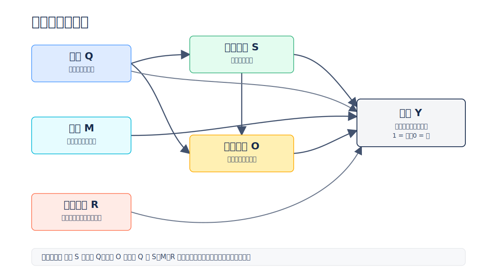
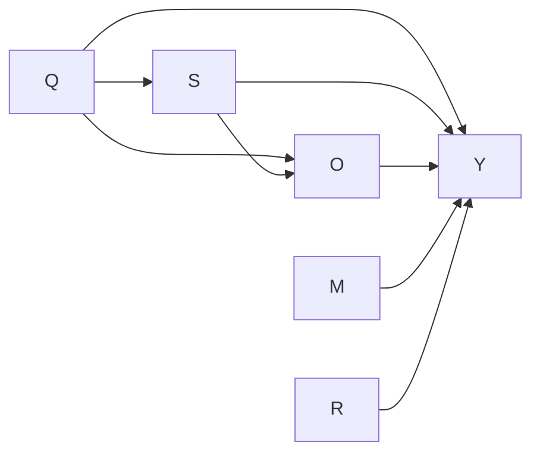

# AI 结构洞实验：完整研究说明

本文解释项目研究什么、为什么这样设计、数据怎样产生、四个 Study 如何衔接，以及结果能够支持什么结论。运行命令请看[操作手册_宝宝级.md](操作手册_宝宝级.md)，快速概览请看[四个实验_宝宝版.md](四个实验_宝宝版.md)。

## 1. 研究问题

在带检索或多候选的信息环境里，大模型经常需要从多篇材料中选出一篇作为回答依据。被选中的文章相当于占据了连接“外部信息”和“模型回答”的桥接位置。

项目借用社会网络中的“结构洞”比喻，研究两个问题：

1. 一篇文章的哪些内容和结构特征，会提高它被模型采纳或引用的概率？
2. 如果这些特征只是伪造出来的外观，模型是否仍然会被吸引？

这里研究的是**候选文章之间的相对选择**，不是传统检索阶段的召回率，也不是最终回答的事实正确率。

## 2. 一页看懂完整流程


最核心的实验逻辑是：为同一个问题制作目标文章的不同版本，让它们面对相同的竞争环境。如果两个版本只在一个特征上不同，那么被选概率的差异才可以归因于该特征。

## 3. 变量与八个文章特征

### 3.1 实验中的主要变量

| 符号 | 变量 | 含义 |
| --- | --- | --- |
| Q | Query | 用户问题及其所属领域 |
| S | Semantic features | 文章写了什么 |
| O | Organizational features | 文章怎样组织信息 |
| M | Model | 哪个模型负责选择 |
| R | Retrieval/competition context | 候选数量、位置和竞争者 |
| Y | Outcome | 目标文章是否被选中，1=是，0=否 |

### 3.2 内容特征 S

| 编号 | 名称 | 档位 |
| --- | --- | --- |
| S1 | 证据坚实度 | 无证据 / 笼统依据 / 具体证据与来源 |
| S2 | 视角辩证度 | 不说明局限 / 说明风险、局限和边界 |
| S3 | 领域专业性 | 通俗描述 / 专业概念与机制解释 |
| S4 | 主张明确性 | 结论含糊 / 明确结论与选择理由 |

### 3.3 结构特征 O

| 编号 | 名称 | 档位 |
| --- | --- | --- |
| O1 | 信息呈现形态 | 连续段落 / 列表或表格 |
| O2 | 宏观信息顺序 | 结论后置 / 结论前置 |
| O3 | 逻辑结构显性化 | 无功能标签 / 使用小标题标注结构 |
| O4 | 证据—主张邻近性 | 远离 / 紧邻 / 同句绑定 |

完整操作定义以 `ai_structural_holes/codebook.py` 为准。

O4 有一个特殊依赖：没有证据，就无法讨论证据离主张多远。因此 Study 1 测 O4 时，会把 S1 固定在最高档，再比较 O4 的低档和高档。O4 的结果应解释为“**在已有较强证据的条件下**，改变证据位置的效应”，不能解释为所有文章中的无条件效应。

## 4. 为什么需要因果设计

### 4.1 观察相关性不等于因果效应

现实中，高质量作者可能同时提供数据、使用小标题、写得更专业，也更熟悉搜索优化。如果只统计网上文章，就很难区分究竟是哪一个特征产生作用。

实验因此采用人为干预：主动控制文章特征，而不是被动观察自然文章。理想情况下，处理文和对照文具有相同的问题、事实、主张、长度、语言质量和竞争者，只改变目标特征。

需要特别强调：这是**因果解释成立的条件**，不是生成模型自动能够保证的事实。材料质检决定了这个条件是否真的成立。

### 4.2 项目的因果图



可编辑源图见 [`figures/causal_graph.mmd`](../figures/causal_graph.mmd)。对应的 Mermaid 结构如下：



它表达以下假设：

- 问题 Q 会影响文章适合采用什么内容和结构，也会直接影响选择难度。
- 内容 S 会影响文章结构 O。
- S、O、模型 M 和竞争环境 R 都可能影响选择结果 Y。

对应的后门调整集为：

```text
研究 S：控制 Q
研究 O：控制 Q 和 S
研究 M、R：在图中视为根节点，不另设后门调整集
```

后门调整写成公式是：

```text
P(Y | do(X)) = Σa P(Y | X, A=a) × P(A=a)
```

直白地说，就是在相同问题和其他必要条件下比较处理与对照，再按真实样本分布求平均。

### 4.3 两条估计路线

- **实验路线**：X 被直接操纵且设计平衡时，可用 `P(Y|X)` 估计 `P(Y|do(X))`。
- **后门路线**：特征自然共变或同时变化时，使用分层或 g-computation 控制混杂变量。

Study 1 主要采用实验路线；Study 2 的多特征组合更依赖回归和后门调整。两条路线的一致性可以作为诊断，但不能替代材料效度检查。

## 5. 实验材料从哪里来

### 5.1 问题 Q

项目支持两种来源：

- `builtin`：内置的少量主题，适合测试代码。
- `pool`：从 DuReader 等数据导入并冻结的真实问题，适合正式实验。

真实题库存放在 `data/query_pool/`。每条记录包括问题、领域和若干真实网页段落。

### 5.2 基线文章

LLM 路线先为每个问题生成一篇基线文章，存入 `data/base_articles/`。所有变体都从同一基线改写，以减少事实和文风差异。

当前基线生成会执行规则检查：正文不能过短，也应被规则检测器判为八个维度的基线档位；最多重试若干次，失败后回退模板。

正式实验中，`template_fallback` 基线应人工复核、重新生成或剔除，不能因为程序“能继续运行”就直接视为合格材料。

### 5.3 变体文章

变体有两条生成路线：

- `template`：程序拼接固定片段。优点是便宜和确定；缺点是文本短、自然度低，只适合联调和单元测试。
- `llm`：让生成模型从冻结基线受控改写。正式实验应采用这一条路线。

当前 LLM 变体流程会把八个目标档位写进提示词，只要模型返回非空正文就接受；最多因空响应重试三次。分析数据使用的是预先指定的 `intended_profile`，而不是对正文重新识别出的档位。

这意味着：

- 当前没有自动证明变体真正实现了目标特征。
- 当前没有自动证明处理文和对照文只改变了一个特征。
- 提示词中的“保持篇幅 ±10%”是写作要求，不是程序硬门槛。
- 模型连续返回空内容时仍会回退模板。

因此，正式实验必须在选择任务之前独立质检变体。建议至少检查：目标特征是否实现、其他特征是否漂移、事实和立场是否一致、长度差异、问题相关性、表达质量和来源真实性。

成功生成的变体存入 `data/variant_articles/`。复用条件包括文章 ID、生成模型和基线文本哈希均一致。

### 5.4 干扰文章

干扰文章也有三种来源：

- `template`：模板生成，只适合测试。
- `llm`：从基线改写生成。
- `real`：使用题库中的真实网页段落，最接近真实竞争环境。

正式实验通常建议 `--query-source pool --distractors real --gen-route llm`：问题和竞争者来自真实语料，目标文章仍由实验设计控制。

## 6. 一次模型选择是怎样完成的

### 6.1 组成候选集

每个候选集包含一篇目标文章和若干干扰文章。当前公共装配流程会为同一问题先抽取一次共享干扰文章，然后复用于该问题下的所有目标版本，因此 Study 1 的处理文和对照文面对相同竞争者。

### 6.2 平衡候选位置

模型可能偏爱第一篇或最后一篇文章。默认 `all_positions` 会让目标文章依次出现在每个位置。分析时还会记录 `target_position`。

位置平衡并不表示“模型没有位置偏差”，而是让位置偏差不会系统性偏向处理组或对照组。

### 6.3 请求模型选择

模型收到用户问题、带 A/B/C 标签的候选文章和固定 JSON 输出要求。默认（`--output-mode minimal`）只需返回：

```json
{"choice": "B"}
```

即可产生主结局 `Y`。如需审计，可用 `--output-mode full` 要求额外返回 `ranking`、`scores`、`reason`（当前主分析不依赖这些字段）。

DeepSeek 模型走 DeepSeek 官方 API；其他模型走 OpenRouter。相同请求会使用磁盘缓存，减少重复费用。

### 6.4 解析与结果 Y

解析器会处理纯 JSON、代码围栏和夹杂正文的完整 JSON 对象。合法选择转成目标文章的 `Y=1/0`，无法解析则记 `parse_ok=0`。

解析失败不是“模型明确没有选择目标文章”，而是结果缺失。当前 Study 1 会在 ATE/EI 分析中剔除解析失败，同时仍将它们保存在 `trials.csv` 供审计。

## 7. 四个 Study 的设计

### 7.1 Study 1：单特征配对干预

每个问题对八个特征分别建立一组处理文和对照文。核心输出：

- `trials.csv`：全部模型调用记录；
- `ate.csv`、`ate_forest.png`：各特征的平均处理效应；
- `ei_leverage.csv`、`ei_leverage.png`：各特征的 EI 排名。

当前实现已经做了三项关键处理：

- 解析失败不作为 `Y=0` 进入主分析；
- 每个特征的 EI 只使用 `target_dim` 等于该特征的配对数据；
- ATE 置信区间按 `query_id` 做聚类自助，避免把位置和 seed 重复当作独立样本。

### 7.2 Study 2：分数析因和交互

Study 2 同时操纵八个特征的高低档，通过较少的组合估计主效应和关键交互：`S1:O4`、`S1:O2`、`O1:O3`。

核心输出：

- `coefficients.csv`：聚类稳健逻辑回归系数、优势比和区间；
- `ei_leverage.csv`：多特征环境下的 EI。

分数析因设计不是随便抽取组合。正式报告前应检查设计矩阵是否平衡、主效应是否与交互混叠，以及样本是否足以估计指定交互。

### 7.3 Study 3：跨条件泛化

Study 3 在多个模型、领域、提示风格和位置上重复单特征设计，输出分模型、分领域 EI 和排名一致性。

核心输出：

- `ei_by_model.csv`；
- `ei_by_domain.csv`；
- 控制台打印的 `kendall_w` 和 `mean_spearman`。

Study 3 使用 OFAT 数据，已与 Study 1 口径对齐：分层 EI（`_ei_by`）与跨模型一致性（`cross_model_consistency`）均显式传入 `scope_col="target_dim"`，并先剔除 `parse_ok==0` 的缺失结果，避免其他特征实验中的固定档位混入比较组。

### 7.4 Study 4：真实与伪造特征

Study 4 对 S1、S3 比较 `none / genuine / fake` 三类版本，输出：

- `deception.csv`：欺骗增益、真实性折扣和脆弱性；
- `delta_ei.csv`：真实路线与伪造路线的 EI 差。

标签本身不能证明真实性。正式实验必须保存可核验来源，并由独立评审确认 genuine 与 fake 的真实性状态。

当前 Study 4 的三个版本会分别调用候选集构造函数，尚未像公共 `assemble()` 一样显式传入固定干扰文章。因此正式报告前还应让 `none / genuine / fake` 面对完全相同的竞争者，否则欺骗指标会混入竞争环境差异。

## 8. ATE 和 EI 怎样理解

### 8.1 ATE：方向和实际幅度

```text
ATE = P(Y=1 | 处理) - P(Y=1 | 对照)
```

如果 ATE 为 `0.05`，表示处理使目标文章的平均被选概率提高了 5 个百分点。ATE 为负则说明该特征可能降低被选概率。

判断结果时不能只看正负，还要看：

- 置信区间是否跨 0；
- 独立问题数量，而不是 trial 总行数；
- 不同领域和模型下是否同方向；
- 材料是否满足配对和操纵要求。

### 8.2 EI：特征对决策的区分能力

EI 使用各档位下的干预分布：

```text
EI(X→Y) = 平均 KL[P(Y|do(X=x)) || 平均结果分布]
```

通俗地说，如果切换 X 的档位几乎不改变选择结果，EI 接近 0；如果不同档位让结果明显不同，EI 较大。

输出中有两个归一化指标，含义不同：

| 列名 | 公式 | 含义 |
| --- | --- | --- |
| `EI_norm` | `EI / log2\|Y\|` | 占结果空间理论最大信息量的比例（二值 Y 时与 `EI` 数值相同，上限 1） |
| `EI_share` | `EI / Σ EI` | 各特征之间的相对杠杆占比，**总和为 1**，适合排序和作图 |

EI 有三个解释边界：

1. EI 不提供方向。一个特征强烈提高选择和强烈降低选择都可能有高 EI，方向必须看 ATE。
2. `EI_norm=0.03` 不等于“解释了 3% 的选择结果”。它是占 1 bit 理论上限的 3%。`EI_share=0.70` 则表示该特征占全部特征总杠杆的 70%。
3. EI 的输入必须来自正确的对照范围。Study 1 计算 S1 时，只能使用 S1 自己的处理—对照对，不能把其他七个实验中恰好 `S1=0/2` 的行混进来。

## 9. 怎样阅读输出

建议按以下顺序检查：

1. `trials.csv`：先看样本规模、`parse_ok`、模型、领域、位置和生成方式是否符合预期。
2. 变体清单与正文：检查是否有 `template_fallback`、异常字数或明显不相关文本。
3. `ate.csv`：看效应方向、幅度和聚类置信区间。
4. `ei_leverage.csv`：看特征区分能力排名，并与 ATE 方向联合解释。
5. 分模型、分领域结果：检查是否发生方向反转。
6. Study 4 的真实性材料：确认 genuine/fake 标签经过独立验证。

不要因为柱状图看起来差异很大，就跳过解析率、材料质量和聚类单位检查。

## 10. 当前实现与正式实验要求

| 环节 | 当前代码 | 正式实验还应做到 |
| --- | --- | --- |
| 基线文章 | 规则检测，失败可回退模板 | 人工复核；回退文重生成或剔除 |
| LLM 变体 | 非空即接受，记录设计标签 | 独立语义质检、配对检查、等长检查 |
| 竞争环境 | 同一问题共享干扰文章，位置平衡 | 保存候选 ID 并审计相关性与强弱 |
| 输出解析 | 容错解析并记录 `parse_ok` | 报告解析率；失败视为缺失并做敏感性分析 |
| Study 1 ATE | 配对估计，按问题聚类 | 报告问题数和聚类区间 |
| Study 1 EI | 已按 `target_dim` 限定 | 同时报告对应干预概率和 ATE |
| Study 2–4 | 已有基础分析实现 | 统一解析失败处理、聚类单位和口径审计；Study 4 固定三组竞争者 |
| 真实性 | 由生成提示和标签指定 | 保存来源并由独立评审核验 |

详细威胁和验收方式见[validity_threats.md](validity_threats.md)。

## 11. 结论应怎样表述

只有在材料操纵、竞争环境、解析率和统计口径都通过验收后，才适合写：

> 在本研究的模型、问题和候选环境中，将 X 从基线档位干预到最高档，使目标文章的平均被选概率变化了若干个百分点。

如果材料仅由生成提示指定、没有独立验证，更准确的说法是：

> 被分配到 X 处理条件的文章表现出不同被选率，但差异可能同时包含未验证的文本变化。

这两句话看起来只差一点，科学含义却完全不同。实验的可信度不只来自公式，更来自材料和分析是否真的兑现了设计假设。
