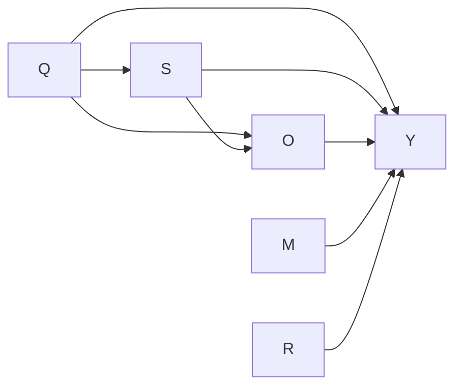
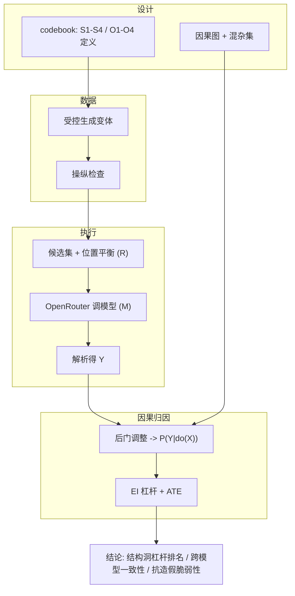

# 实验说明（详细版）：AI 结构洞实验是怎么进行的

本文用尽量直白的语言，逻辑严密地讲清楚**整个实验从头到尾在做什么、为什么这么做、
每一步怎么衔接**。读完你应该能向别人完整复述这套实验。

阅读顺序建议：先看「一、研究要回答什么」和「二、一句话看懂全流程」，再按需深入后面各节。

---

## 一、研究要回答什么

### 1.1 背景比喻：什么是"AI 结构洞"

社会学里有个概念叫"结构洞（structural hole）"：在一张关系网里，如果别人之间有
"缺口"，而你正好架在缺口上当桥梁，你就掌握了信息流动的主动权、获得优势。

把这个比喻搬到大模型上：当用户提问，AI（尤其是带检索的 RAG 系统）会从**一堆候选文章**
里挑出它"愿意采纳、愿意引用"的那篇作为回答依据。**谁被选中，谁就占据了那个"桥接位置"。**
我们想知道：一篇文章到底靠什么"特征"，才能更大概率地被 AI 选中？

### 1.2 两个方向

- **正向（怎么让 AI 更愿意选我）**：哪些**内容特征**会显著提高一篇文章被大模型当作
  推荐/判断依据的概率？
- **反向（AI 会不会被骗）**：如果这些特征是**伪造**的（假数据、假权威、堆术语），
  AI 还会不会照样被诱导选中？这是安全/可信问题。

### 1.3 一个贯穿始终的追问

同样的结论，会不会因为**换了模型、换了任务领域、换了提问方式、换了竞争环境**就不一样？
所以实验必须跨这些条件去验证。

---

## 二、一句话看懂全流程

> 我们**人为地、受控地**制造很多"只在某一个特征上有差别"的文章，把它们放进候选池让
> 大模型来选，记录"选没选中"，再用**因果方法**算出"每个特征到底对'被选中'有多大因果作用"。


后面每一节，就是把这 7 个方框逐个讲透。

---

## 三、核心概念与变量（先把"名词"讲清楚）

整套实验围绕这几个变量（字母代号会反复出现）：

| 代号 | 名字 | 通俗解释 |
| --- | --- | --- |
| **Q** | 用户查询 | 用户问的问题（带"领域"，如健康、金融） |
| **S** | 语义特征 | 文章"说了什么"，含 S1~S4 四个维度 |
| **O** | 结构特征 | 文章"怎么排版组织"，含 O1~O4 四个维度 |
| **M** | 模型 | 哪个大模型在做选择（GPT、Claude…） |
| **R** | 竞争环境 | 候选有几篇、目标排在第几位、对手强弱 |
| **Y** | 决策结果 | 模型最终选没选中这篇（1=选中，0=没选） |

### 3.1 语义层 S（文章"内容"层面）

- **S1 证据坚实度**：有没有具体数据、第三方来源、权威机构、用户评价。
  三档：无 / 笼统断言 / 扎实（有数字+来源）。
- **S2 视角辩证度**：有没有讲风险、局限、反方、适用边界。二档：没有 / 有。
- **S3 领域专业性**：有没有专业术语、概念框架、机制解释。二档：没有 / 有。
- **S4 主张明确性**：有没有直接给明确结论、核心优势、选择理由。二档：没有 / 有。

### 3.2 结构层 O（文章"排版组织"层面）

- **O1 信息呈现形态**：连续段落 vs 列表/表格。
- **O2 宏观信息顺序**：结论后置 vs 结论前置（开头就给摘要/结论）。
- **O3 逻辑结构显性化**：有没有小标题、"优点/局限/结论"这种功能标注。
- **O4 证据—主张邻近性**：证据离它支持的主张有多近。三档：很远 / 紧邻 / 同句绑定。

> 这些定义写死在代码 `ai_structural_holes/codebook.py` 里，是全实验唯一的"标准答案"，
> 数据生成、质检、分析都引用它，保证口径一致。

---

## 四、为什么必须用"因果"方法（这是全实验的灵魂）

### 4.1 普通"相关"会骗人

如果只是去网上爬一堆文章，统计"有数据的文章是不是更常被引用"，会有一个陷阱：
**好作者往往既会摆数据（S1高）、又会好好排版（O好）、内容本身也确实好**。于是你分不清
到底是"数据"起作用，还是"作者本来就强"在起作用。这个看不见的"作者真实水平"就是
**混杂因素（confounder）**，它会让相关性结论失真。

### 4.2 我们的解法：人为控制变量（do 干预）

因为文章是**我们自己生成/改写的**，我们可以做到"两篇文章其它都一样、只有 S1 不同"。
这就等于直接**给 S1 做了干预**（因果里写成 `do(S1)`）。这样一比，差异就**只能**归因于 S1，
混杂被切断了。这就是因果推断里最干净的"随机对照实验"思路。

### 4.3 因果图（DAG）：我们对世界的假设



边的含义：

- `Q→S, Q→O`：问题决定了文章写什么、怎么写。
- `S→O`：内容决定能用什么结构（**有证据，才谈得上"证据邻近"**——这条很关键，见 4.5）。
- `S→Y, O→Y`：语义和结构影响模型的选择——**这正是我们要测的主效应**。
- `Q→Y`：问题本身和文章的相关性也影响选择。
- `M→Y, R→Y`：换模型、换位置/竞争也会影响选择。

### 4.4 混杂集与"后门调整"（定理 1）

对每个想研究的"因 X"，要找出"同时影响 X 和 Y"的变量（叫**混杂集 A_X**），把它们
"控制住"，才能得到干净的因果效应。根据上面的图推出：

- 研究 **S**（及 S1~S4）：混杂集 `A_S = {Q}`（路径 S←Q→Y）。
- 研究 **O**（及 O1~O4）：混杂集 `A_O = {Q, S}`（路径 O←Q→Y、O←S→Y）。
- 研究 **M、R**：它们是"源头"，没有混杂，`A_M = A_R = {}`。

**后门调整公式（定理 1）**——在控制住混杂集后求真实因果效应：

```
P(Y | do(X)) = Σ_{A_X}  P(Y | X, A_X) · P(A_X)
```

直白说：**在混杂因素的每一种取值下分别看 X 的效果，再按混杂因素的真实分布加权平均。**
代码实现在 `ai_structural_holes/causal/backdoor.py`，提供两种算法：
- `stratify`：严格照公式分层求和（最忠实，但数据要够多）。
- `gcomp`：用逻辑回归"标准化"（更省数据，默认用它）。

### 4.5 两条互相印证的路线

- **实验路线（直接 do）**：我们随机化、强行控制 S/O，此时 `P(Y|do(X)) = P(Y|X)`，
  直接数频率即可。
- **SCM 路线（后门调整）**：让 S/O 像真实世界一样自然共变，再用定理 1 去偏。

为什么要两条？因为 `S→O` 这条边意味着：**强行让"有证据邻近(O4)"却"没有证据(S1)"
是不自然的**。所以 O 这类维度更适合走 SCM 后门路线；而两条路线得到的结论应当一致，
一致性本身就是结果可靠的证据（代码 `analysis/metrics.py::do_route_consistency`）。

---

## 五、用 EI（有效信息）给每个特征"打因果分"

拿到干净的 `P(Y|do(X))` 后，还需要一个**统一的尺子**来比较 S1、S2…O4 谁的因果作用更强。
我们用**有效信息 EI（Effective Information）**。

### 5.1 EI 在测什么

想象我们"均匀地"把某个特征 X 拨到它的各个档位（最大熵干预），看 Y 的反应分布变化有多大：

```
EI(X→Y) = (1/特征档位数) · Σ_x  KL( P(Y|do(X=x))  ‖  平均的P(Y) )
```

- **EI 越大** = 拨动这个特征，模型的选择结果变化越剧烈、越有区分度 → 这个特征是
  越强的"结构洞杠杆"。
- 它还能拆成两部分：`EI = 确定性(determinism) − 简并性(degeneracy)`。
  - 确定性高：改这个特征几乎稳定地改变结果（好杠杆）。
  - 简并性高：不管怎么改结果都差不多（其实没区分度）。
- 归一化 `EI~ = EI / log2(Y的状态数)`，落在 0~1，方便横向比较所有特征。

代码在 `ai_structural_holes/causal/ei.py`。我们用合成数据验证过：
**完全决定结果时 EI=1 比特，完全无作用时 EI=0**，且恒等式 `EI=确定性−简并性` 成立。

### 5.2 EI 和 ATE 的分工（都看，互补）

- **ATE**（平均处理效应）回答："加上这个特征，被选概率**平均提升了几个百分点**"——看
  **方向和幅度**。
- **EI** 回答："这个特征对结果的**因果控制力/区分度**有多强"——看**杠杆强弱**。
- 两个一起看才全面：有的特征 ATE 不算大但 EI 高（稳定可控），有的相反。

---

## 六、端到端每一步在做什么（把 7 个方框讲透）

### 步骤 1：受控生成文章变体（造数据）

- 先按领域生成一批**查询 Q**（消费品、健康、金融、学术、旅行），每个查询有一个固定的
  "事实内核"（核心话题），保证后面所有变体**话题不变、只改特征**。
- 对每个查询，按"特征配方（profile）"生成文章。配方就是给 S1~S4、O1~O4 各指定一个档位。
- 生成有两条路：
  - **模板路线**（离线、确定性）：把不同特征对应的"标记片段"拼成文章。它能保证"只改目标
    维度"，是离线演示和测试的基础。
  - **大模型改写路线**：给模型一段改写指令，要求"锁定话题/事实/篇幅，只改指定特征"。
- 代码：`ai_structural_holes/data/generation.py`。

### 步骤 2：操纵检查（质检：确认"只改了该改的"）

生成完不能盲信，必须验证两件事：
1. **目标维度确实变了**（比如想让 S1 从"无"变"扎实"，文中真的出现了数字+来源）。
2. **其它维度没被连累**（没有"顺手"把 O4、S4 也改了）。
3. 篇幅没大幅变化（防止"文章变长"这种干扰，叫冗长偏好）。

不通过的变体就丢弃重做。代码：`ai_structural_holes/data/manipulation_check.py`
（`check_pair` 返回是否通过 + 漂移了哪些维度）。我们已用测试确认 8 个维度逐个单改都不串味。

### 步骤 3：摆擂台——候选集与位置平衡（构造竞争环境 R）

- 把"目标文章"和若干"干扰文章"放在一起组成**候选集**（比如 3 篇）。
- **位置平衡**：模型有"位置偏好"（容易选排在前面的）。为排除这种干扰，我们让目标文章
  **轮流出现在每一个位置**（第 1、第 2、第 3…），分析时再把位置当变量校正。
- 代码：`ai_structural_holes/task/protocol.py::build_candidate_sets`。

### 步骤 4：向模型提问（经 OpenRouter 统一调用）

- 把候选集组织成一段提示词，要求模型"选出最值得作为依据并引用的一篇，并按固定 JSON 格式
  回答"。提示词有 4 种风格（中性 / 要求标注来源 / 批判性评估 / 专家角色），本身也是一个实验因子。
- 所有模型都通过 **OpenRouter** 这一个接口调用，换模型只改名字。内置：失败重试、限速退避、
  **磁盘缓存（相同请求不重复花钱、保证可复现）**。
- 代码：`ai_structural_holes/llm/client.py`、`ai_structural_holes/task/prompts.py`。

> 没有配密钥时，会自动用一个"假模型 MockClient"离线空跑，只为打通流程，**不是真实结果**。

### 步骤 5：记录结果 Y（解析模型选了谁）

- 模型返回 JSON，我们解析出：它选了哪篇（choice）、排名（ranking）、各篇可信度打分（scores）。
- 转成一行一行的表格：每行 = "某次提问中，目标文章被选中没（Y=1/0）" + 它的特征配方 +
  当时的模型/提示/位置/领域等。这张表是后续所有分析的输入。
- 解析做了容错：模型不守格式也不会崩，会标记 `parse_ok=False`。
- 代码：`ai_structural_holes/task/protocol.py::parse_decision`、`experiment/runner.py`。

### 步骤 6：因果分析（后门调整 + EI，见第四、五节）

- 对每个特征：先求干净的 `P(Y|do(X))`（实验路线或后门调整），再算 EI 和 ATE。
- 汇成**特征杠杆排名表**（`ei_leverage_table`），并出柱状图/森林图。
- 还做：跨模型一致性、位置偏差、调节/中介（如 O4 是否放大 S1）。

### 步骤 7：出结论

- 结果存到 `outputs/<study>/` 的 CSV 和 PNG。怎么读见第八节。

---

## 七、四个 Study：各回答一个问题

我们不是跑一个大实验，而是分四个递进的子实验（代码在 `ai_structural_holes/studies/`）。

### Study 1 — 单特征配对干预（每个特征单独的因果效应）

- 做法：从一篇"全基线"的文章出发，**一次只改一个特征**到最高档，生成"对照/处理"配对。
- 回答：**每个特征单独**对"被选中"的 ATE 有多大、方向如何；每个特征的 EI 是多少。
- 输出：`ate.csv`、`ei_leverage.csv/png`。
- 特别处理：因为 `S→O`，O4（证据邻近）只在"已有证据 S1"的文章上去切换。

### Study 2 — 分数析因（特征之间的交互）

- 做法：用"分数析因设计"**同时**改动 8 个特征的多种组合（而不是一次一个）。
- 回答：主效应之外，**特征间是否有交互**，重点看 S1×O4（证据 + 邻近是否相互放大）、
  S1×O2、O1×O3。
- 输出：回归系数表 `coefficients.csv` + EI 表。
- 注：中介/交互这类分析应在 Study 2 的数据上做，因为这里 S 和 O 才会**联合变化**。

### Study 3 — 泛化性（结论稳不稳）

- 做法：把 Study 1 的设计，铺到**所有模型 × 所有领域 × 所有提示风格 × 所有位置**上重复。
- 回答：特征的因果排名**在不同条件下是否一致**。
- 输出：分模型/分领域的 EI 表，以及跨模型一致性（**Kendall's W、Spearman**，越接近 1 越一致）。

### Study 4 — 反向 / 对抗（能不能骗 AI）

- 做法：对"可伪造"的特征（S1 证据、S3 专业性），各做三版：**没有 / 真实 / 伪造**
  （伪造=有数字有来源的样子，但内容是编的）。
- 回答：
  - **欺骗增益** = P(选|伪造) − P(选|没有)：造假能多骗到多少被选概率。
  - **折扣** = P(选|真实) − P(选|伪造)：模型对造假有没有警惕、打折多少。
  - **脆弱性** = P(选|伪造) / P(选|真实)：接近 1 说明模型几乎分不清真假，很危险。
  - **ΔEI**：伪造路线 vs 真实路线的因果杠杆差。
- 输出：`deception.csv`、`delta_ei.csv`。

---

## 八、结果怎么读（拿到表格/图之后）

打开 `outputs/<study>/`，重点：

- **`ei_leverage.png`（最重要）**：横向柱状图，柱子越长（EI~ 越大）的特征，越是能
  **因果地**左右模型选不选你。这就是"结构洞杠杆排名"。
- **`ei_leverage.csv`**：同样内容的表格，含 `EI`、`EI_norm`、`determinism`、`degeneracy`、`ATE`。
  - 看 `EI_norm` 排名定"谁最关键"；看 `ATE` 的正负定"是加分还是减分"。
- **`ate_forest.png`**：每个特征让"被选概率"变化了多少，带误差线（线不过 0 才算显著）。
- **Study3 `ei_by_model.csv`** + 控制台打印的 `kendall_w`：不同模型结论一致性。
- **Study4 `deception.csv`**：看 `deception_gain` 和 `vulnerability`，判断模型抗造假能力。
- `trials.csv` 是最原始的逐次记录，需要追溯细节时看它。

**举例解读**（示意，非真实结论）：若 `ei_leverage.csv` 里 S1 和 O4 的 `EI_norm` 最高、
`ATE` 为正，说明"摆出扎实证据、并让证据紧贴主张"是最有效的"结构洞"策略；若 Study4 里 S1
的 `vulnerability` 接近 1，则说明该模型容易被"假证据"骗，是个可信性风险点。

---

## 九、我们如何保证结果可信（效度控制）

| 担心的问题 | 我们的做法 |
| --- | --- |
| 改一个特征却连累了别的 | 操纵检查逐维核对，漂移就重做 |
| 模型偏爱靠前的候选 | 位置轮流平衡 + 把位置当协变量校正 |
| 模型回答有随机性 | 每个条件多次重复（`--seeds`）取平均 |
| 文章变长本身带来优势 | 控制篇幅（±10%），并把长度纳入考量 |
| 模型"见过"这些内容 | 用合成/新颖话题，降低数据污染 |
| 用大模型造数据带入风格偏差 | 模板化生成 + 人工抽检 + 跨生成器交叉验证 |
| 观察数据里的混杂偏倚 | 后门调整（定理 1）+ 实验 do 双路线互验 |

完整对照见 `docs/validity_threats.md`（每条都标了对应代码）。

---

## 十、必须知道的边界与注意事项

1. **MockClient 不是真实模型**：它用"位置 + 内容标记"打分，仅用于离线打通流程。
   **真实结论必须用 OpenRouter 调真实模型**得到。
2. **先小后大**：先用最小参数试跑、看花费，再放大规模（避免一次性烧太多钱）。
3. **缓存可复现**：相同请求不重复扣费；想彻底重来就删 `.cache` 和 `outputs`。
4. **因果结论的前提是 DAG 假设成立**：我们的因果图是一组明确的先验假设（第 4.3 节），
   结论是"在这套假设下"的因果效应。换假设要重画图、重推混杂集。
5. **怎么动手跑**：见 `docs/操作手册_宝宝级.md`。

---

## 附：一图回顾全实验逻辑


